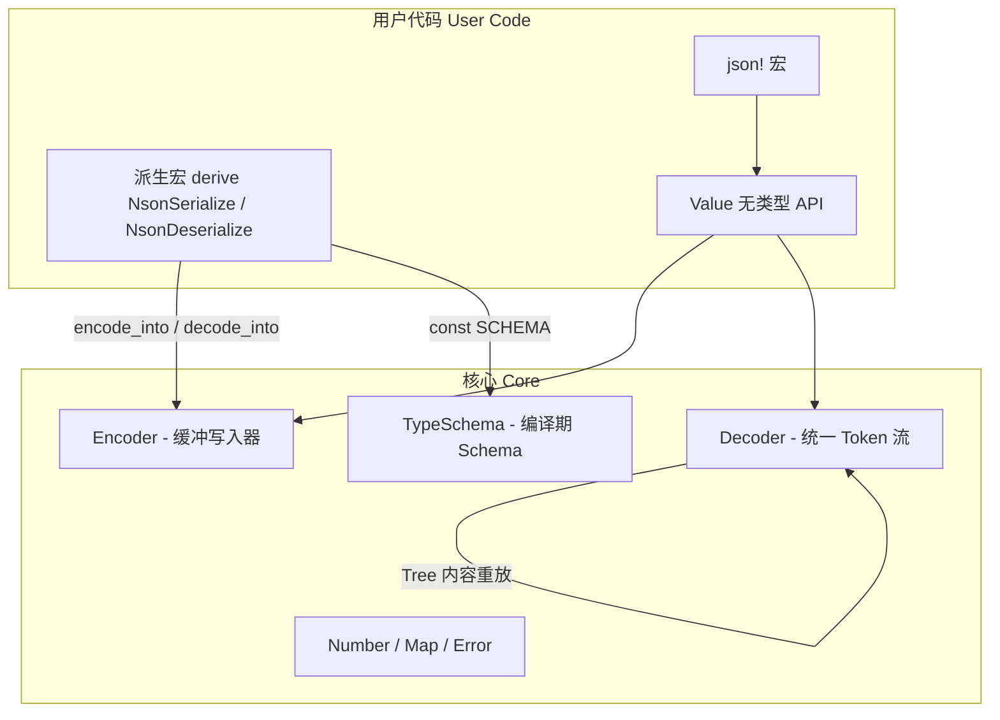

# NextJson

> **零依赖、高性能、原创架构的 JSON 库** / *A zero-dependency, high-performance JSON library with an original architecture*

<p align="center">
  <strong>非 serde 的复制品，而是一套全新的设计 —— 无 Visitor、编译期 Schema、统一 Token 流</strong><br/>
  <em>Not a serde clone — a fresh design: visitor-free, compile-time Schema, unified token stream</em>
</p>

<p align="center">
  <a href="https://github.com/blueokanna/NextJson/actions/workflows/ci.yml"></a>
</p>

---

## 📋 目录 / Table of Contents

- [简介 / Introduction](#-简介--introduction)
- [核心创新 / Core Innovations](#-核心创新--core-innovations)
- [快速开始 / Quick Start](#-快速开始--quick-start)
- [架构 / Architecture](#-架构--architecture)
- [持续集成 / Continuous Integration](#-持续集成--continuous-integration)
- [派生宏属性参考 / Derive Attribute Reference](#-派生宏属性参考--derive-attribute-reference)
- [性能与安全 / Performance & Safety](#-性能与安全--performance--safety)
- [与 serde_json 对比 / Comparison with serde_json](#-与-serde_json-对比--comparison-with-serde_json)
- [已知限制 / Known Limitations](#-已知限制--known-limitations)
- [许可 / License](#-许可--license)

---

## 🌟 简介 / Introduction

`NextJson` 是一个从零实现的 JSON 序列化 / 反序列化库。与市面上主流的 `serde_json` 不同，它**刻意没有沿用 serde 的 `Visitor` 设计模式**，而是采用了一套原创的架构：**schema 驱动（schema-driven）的解码引擎**、**编译期结构元数据（`TypeSchema`）**、以及**统一的 Token 流抽象**。

- ✅ **零第三方依赖**（`[dependencies]` 为空：主库仅依赖自身派生宏，派生宏仅用标准库 `proc_macro` —— 无 `syn` / `quote` / `proc-macro2`，手写递归下降解析器）
- ✅ **原生 `no_std`**：库体 `#![no_std]` + `extern crate alloc`，自定义 `write::Write` 特质替代 `std::io::Write`；`std` 特性可选
- ✅ 库本体默认拒绝 unsafe；局部豁免仅覆盖成功解码后的 `assume_init` 与 RAII 字段槽的 move/drop / Unsafe is confined to audited `MaybeUninit` completion and field-slot move/drop boundaries
- ✅ 完整的中英双语文档，代码注释一律使用英文

### 特性开关 / Feature flags

| 特性 | 默认 | 说明 |
|---|---|---|
| `std` | ✅ | 启用 `from_reader`、`to_io_writer`、标准库网络/路径/同步类型；字符串与切片入口始终可用 / Enables reader, IO writer, and std-only type integrations; string/slice APIs remain available without it |
| `derive` | ✅ | 启用 `NsonSerialize` / `NsonDeserialize` 派生宏（`nextjson-derive`） |

```toml
# 纯 no_std 用法（核心 + alloc，无派生宏）
nextjson = { version = "0.1", default-features = false, features = ["derive"] }

# 完整 no_std（仅核心 + alloc）
nextjson = { version = "0.1", default-features = false }
```

---

## 🧠 核心创新 / Core Innovations

`NextJson` 与 serde 的本质区别体现在四个层面：

### 1. 无 Visitor 的双向契约（Visitor-free dual contract）

serde 的核心抽象是 `Visitor` trait —— 反序列化时由 `Deserializer` 逐个回调 `visit_*` 方法。`NextJson` 完全移除了这一层：

```rust
// serde 风格：需要实现 Visitor 并回调
impl<'de> Deserialize<'de> for Point {
    fn deserialize<D>(d: D) -> Result<Self, D::Error> {
        d.deserialize_struct("Point", FIELDS, PointVisitor)
    }
}

// NextJson 风格：直接把值就地解码进调用方提供的未初始化槽位
impl<'de> NsonDeserialize<'de> for Point {
    fn decode_into(d: &mut Decoder<'de>, out: &mut MaybeUninit<Self>) -> Result<()> {
        // ... 把 x/y 直接写入 out 指向的内存 ...
    }
}
```

**`decode_into` 的意义**：值被直接写入调用方提供的 `MaybeUninit` 槽位 —— 支持**内存复用**（解码到已分配的对象池 / 缓冲区中）与**零初始化开销**（无需先 `Default` 再覆盖）。这是 serde 的 `Deserialize::deserialize` 无法直接做到的（它总是返回新分配的值）。

### 2. 编译期 Schema（Compile-time Schema）

serde 的 derive 宏在编译期被完全展开，**不留下任何可内省的结构描述**。`NextJson` 为每个类型生成一颗 **`const SCHEMA: TypeSchema`** —— 在编译期构造、运行时随时可内省的元数据树：

```rust
const SCHEMA: TypeSchema = TypeSchema::Struct(&StructSchema {
    name: "Person",
    fields: &[
        FieldSchema { name: "firstName", orig: "first_name", required: true, .. },
        // ...
    ],
});
```

这使得以下能力成为可能（serde 做不到）：

```rust
// 运行时内省任意类型结构
let schema = nextjson::schema_of::<Person>();

// 直接生成 JSON Schema（draft-07 风格）
let js = nextjson::to_json_schema::<Person>();
```

### 3. 统一 Token 流（Unified token stream）

`Decoder` 内部持有两种**实现完全相同解码原语**的输入源：

| 输入源 | 用途 |
|---|---|
| `Bytes` | 直接对 `&[u8]` 做**惰性单 Token 前瞻**词法分析（无预解析、字符串无转义时零分配借用输入） |
| `Tree` | 对内存中的 `Vec<Token>` 重放（供内部标签 / 邻接标签枚举的内容提取、`Value` 驱动的解码） |

因此，内部标签枚举、无标签枚举、`Value` 往返、`from_value` 全部复用同一套解码代码 —— 而 serde 需要维护两套机制（`Deserializer` + `ContentDeserializer`）。

### 4. 手写热路径（Hand-written hot paths）

- 整数写出：itoa 风格的逐字节写出（零分配）；
- 浮点写出：最短往返表示，且整数形式的浮点补 `.0`（`1.0` ≠ `1`），保持浮点语义；
- 字符串转义：单遍扫描，无转义字符时整段拷贝；
- 数字解析：手写溢出检测的整数解析 + 标准库最短往返浮点算法；
- 惰性单 token 前瞻：每次只词法分析一个 token，内存访问局部性极佳。

---

## 🚀 快速开始 / Quick Start

```toml
[dependencies]
nextjson = "0.1"
```

```rust
use nextjson::{NsonSerialize, NsonDeserialize, json};

#[derive(NsonSerialize, NsonDeserialize, Debug, PartialEq)]
#[njson(rename_all = "camelCase")]
struct User {
    first_name: String,
    last_name: String,
    age: u32,
    #[njson(default)]
    note: String,
}

fn main() {
    let u = User {
        first_name: "Ada".into(),
        last_name: "Lovelace".into(),
        age: 36,
        note: String::new(),
    };

    // 序列化
    let text = nextjson::to_string(&u).unwrap();
    assert_eq!(text, r#"{"firstName":"Ada","lastName":"Lovelace","age":36}"#);

    // 美化输出
    println!("{}", nextjson::to_string_pretty(&u).unwrap());

    // 反序列化（字段可乱序、缺失可选字段）
    let back: User = nextjson::from_str(
        r#"{"age":36,"firstName":"Ada","lastName":"Lovelace"}"#,
    ).unwrap();
    assert_eq!(back, u);

    // 无类型 Value + json! 宏
    let v = json!({ "name": "NextJson", "tags": ["fast", "safe"], "nested": { "ok": true } });
    assert_eq!(v["name"], "NextJson".into());

    // 运行时 Schema 内省
    let schema = nextjson::schema_of::<User>();
    assert_eq!(schema.name(), "User");
}
```

---

## 🏗 架构 / Architecture



### 模块划分（高内聚低耦合）

```
nextjson/
├── src/
│   ├── lib.rs          # 顶层入口：to_string / from_str / json! 等
│   ├── ser.rs          # NsonSerialize + Encoder（序列化端）
│   ├── de.rs           # NsonDeserialize + Decoder + 词法器（反序列化端）
│   ├── encode.rs       # 编码器再导出
│   ├── schema.rs       # TypeSchema 编译期元数据
│   ├── error.rs        # 带行列位置的错误模型
│   ├── number.rs       # 精确整数 Number（I64 / U64 / I128 / U128 / F64）
│   ├── map.rs          # 保持插入序的 Map（Vec + BTreeMap 索引）
│   ├── value.rs        # 无类型 Value（AST）
│   ├── json_schema.rs  # TypeSchema → JSON Schema 生成器
│   ├── write.rs        # no_std 自定义 Write 特质（Vec / &mut [u8] 实现）
│   └── private.rs      # 派生宏运行时助手（doc(hidden)）
└── tests/              # 集成、故障注入与零拷贝测试 / Integration, fault-injection, and zero-copy tests
```

---

## 🤖 持续集成 / Continuous Integration

每次 `push` / `pull_request` 由 `.github/workflows/ci.yml` 自动执行四道质量门，全部失败即阻断合并。工作流只用**官方 actions**（`actions/checkout`、`actions/cache`），与库本身一样不引入任何第三方依赖。

| 作业 / Job | 检查内容 / What it checks |
|---|---|
| `fmt` | `rustfmt --check`：任何格式漂移立即失败 / fails on any formatting drift |
| `clippy` | 全特性（`--all-features`）与纯 no_std（`--no-default-features`）两种配置下 `clippy -D warnings` |
| `test` | **stable + MSRV 1.70** × **Ubuntu / Windows / macOS** 矩阵：全特性测试、no_std 单元测试、release 构建 |
| `docs` | `RUSTDOCFLAGS="-D warnings"` 下 `cargo doc`（含 `missing_docs` 强制） |

本地复现任一作业 / Reproduce any job locally:

```bash
cargo fmt --all -- --check
cargo clippy --workspace --all-targets --all-features -- -D warnings
cargo clippy -p nextjson --no-default-features -- -D warnings
cargo test --workspace --all-features
cargo test -p nextjson --no-default-features --lib
cargo build --release --workspace
RUSTDOCFLAGS="-D warnings" cargo doc --workspace --all-features --no-deps
```

MSRV 说明：`rust-version = "1.70"` 由 CI 矩阵中的 `1.70.0` 工具链实际编译验证；`Cargo.lock` 固定为 v3 格式，以便 1.70 的 Cargo 读取。

---

## 🔧 派生宏属性参考 / Derive Attribute Reference

### 容器级 / Container-level

| 属性 | 说明 |
|---|---|
| `#[njson(rename_all = "camelCase")]` | 字段 / 变体统一重命名。支持 `lowercase`、`UPPERCASE`、`PascalCase`、`camelCase`、`snake_case`、`SCREAMING_SNAKE_CASE`、`kebab-case`、`SCREAMING-KEBAB-CASE` |
| `#[njson(rename = "name")]` | 容器重命名（枚举） |
| `#[njson(tag = "type")]` | 内部标签枚举 |
| `#[njson(tag = "t", content = "c")]` | 邻接标签枚举 |
| `#[njson(untagged)]` | 无标签枚举（试错回退） |
| `#[njson(transparent)]` | 透明 newtype（直接透传单个字段） |
| `#[njson(deny_unknown_fields)]` | 未知字段报错 |
| `#[njson(default)]` | 所有缺失字段使用默认值 |
| `#[njson(bound = "T: ...")]` | 覆盖自动泛型边界 |
| `#[njson(crate = "path")]` | 指定 crate 路径（重命名依赖时） |

### 字段级 / Field-level

| 属性 | 说明 |
|---|---|
| `#[njson(rename = "name")]` | 字段重命名 |
| `#[njson(alias = "a", alias = "b")]` | 反序列化别名（可重复） |
| `#[njson(default)]` | 缺失时用 `Default` |
| `#[njson(default = "path::to::fn")]` | 缺失时调用指定函数 |
| `#[njson(skip)]` / `skip_serializing` / `skip_deserializing` | 跳过序列化 / 反序列化 |
| `#[njson(skip_serializing_if = "path")]` | 条件跳过序列化 |
| `#[njson(serialize_with = "path")]` | 自定义序列化函数 |
| `#[njson(deserialize_with = "path")]` | 自定义反序列化函数 |
| `#[njson(with = "module")]` | 模块化的 `serialize` / `deserialize` 对 |
| `#[njson(flatten)]` | 扁平化（内联字段） |
| `#[njson(borrow)]` | 借用输入（`&'a str` 字段零拷贝） |

### 枚举标签模式

```rust
// 外部标签（默认）：{"Circle": 1.5}
#[derive(NsonSerialize, NsonDeserialize)]
enum Shape { Circle(f64) }

// 内部标签：{"kind": "Hello", "name": "alice"}
#[derive(NsonSerialize, NsonDeserialize)]
#[njson(tag = "kind")]
enum Msg { Hello { name: String }, Bye }

// 邻接标签：{"t": "Add", "c": [1, 2]}
#[derive(NsonSerialize, NsonDeserialize)]
#[njson(tag = "t", content = "c")]
enum Op { Add(i32, i32), Clear }

// 无标签：直接匹配内容（自动试错回退）
#[derive(NsonSerialize, NsonDeserialize)]
#[njson(untagged)]
enum Val { Num(f64), Text(String) }
```

### 零拷贝借用 / Zero-copy borrowing

```rust
use alloc::borrow::Cow;

let input = r#""borrowed""#;
let text: &str = nextjson::from_str(input)?;
assert_eq!(text.as_ptr(), input.as_ptr().wrapping_add(1));

let escaped: Cow<'_, str> = nextjson::from_str(r#""line\nfeed""#)?;
assert!(matches!(escaped, Cow::Owned(_)));
# Ok::<(), nextjson::Error>(())
```

无转义字符串直接借用输入中的 UTF-8 区间，不分配也不复制；包含 JSON 转义的字符串必须生成不同的 UTF-8 字节，因此返回拥有所有权的值。派生类型中的 `&'de str` 同样沿用该生命周期。Unescaped strings borrow the exact UTF-8 range from the source buffer with no allocation or copy. Escaped strings necessarily materialize decoded bytes and therefore become owned.

---

## ⚡️ 性能与安全 / Performance & Safety

### 性能设计

- **零分配热路径**：整数 / 布尔 / 无转义字符串 / 结构化的键匹配，全程无堆分配；
- **惰性词法**：每次只 lex 一个 token，不做全量预解析；
- **局部性**：字符串解析直接扫字节，无中间缓冲（仅转义字符串复用 `scratch`）；
- **泛型单态化**：`NsonSerialize::encode<W: Write>` 在编译期实例化，无 trait 对象间接跳转；
- **no_std 无妥协**：整数 / 浮点写出与字符串转义全部在 `core` 上实现（手写 itoa 与格式化缓冲），`no_std` 与 `std` 构建共享完全相同的热路径。

Unescaped `&str` values borrow their exact byte range from the input. Escaped strings decode into owned `String`/`Cow::Owned`, because JSON escape processing necessarily creates different UTF-8 bytes. `no_std` mode requires `alloc`, but never requires `std` or a third-party crate.

### 安全性

- 核心库默认 `#![deny(unsafe_code)]`；局部豁免集中在两个可审计边界：`NsonDeserialize::decode` 成功后的 `assume_init`，以及 `InitSlot<T>` 按初始化标志执行的 move/drop；
- 派生宏为每个字段生成栈上 `InitSlot<T>`：字段直接解码进 `MaybeUninit`，RAII 在失败或重复字段覆盖时析构已初始化值，最终仅一次写入父对象；unsafe 不向安全的公开调用方泄漏 / Generated field slots combine direct `MaybeUninit` decoding with RAII cleanup and a single final parent write;
- **深度限制**：默认 128 层嵌套限制（可配置），防止恶意输入导致栈溢出；
- **错误定位**：解析错误携带精确的 1-based 行列与字节偏移；
- **严格语法**：拒绝前导零、字面量粘连、未转义控制字符、孤立代理项等非法输入。

### 派生宏的实现（零依赖）

`nextjson-derive` 的 `[dependencies]` 为空：不使用 `syn` / `quote` / `proc-macro2`，而是用标准库 `proc_macro` 手写递归下降解析器（支持生命周期、泛型、`where` 约束、嵌套泛型参数），并以**空格敏感**的方式重建 token（保留 `Joint` 间距，确保 `::`、`'a`、`->` 等词法单元正确）。

---

## ⚖️ 与 serde_json 对比 / Comparison with serde_json

| 维度 | `serde_json` | `nextjson` |
|---|---|---|
| 核心抽象 | `Serializer` / `Deserializer` + `Visitor` | `Encoder` / `Decoder` + `decode_into` |
| 结构元数据 | derive 编译即消失，不可内省 | `const SCHEMA: TypeSchema` 运行时可内省 |
| 就地解码 | 不支持（总是返回新值） | 支持（解码进 `MaybeUninit` 槽位，可复用内存） |
| 枚举标签 | 三套机制 | 统一 Token 流一套机制 |
| 依赖 | `serde` + `itoa` + `ryu` + `memchr` 等 | **零第三方依赖**（主库 + 派生宏） |
| `no_std` | 需额外 feature 与配置 | **原生支持**（核心 + `alloc`） |
| 安全声明 | 有少量 unsafe | 文档化的 `MaybeUninit` 边界 + RAII 字段槽 / documented boundary with RAII field slots |
| 浮点语义 | `1.0` 输出 `1.0` | `1.0` 输出 `1.0`（保持一致） |
| 数字表示 | `PosInt(u64)` / `NegInt(i64)` / `Float` | `I64` / `U64` / `I128` / `U128` / `F64`，Rust 128 位整数精确往返 / exact Rust 128-bit integer round trips |

### 设计取舍（诚实说明）

- `nextjson` 的目标是**教学清晰、架构原创、零依赖**；在极端微基准上，`serde_json` 经过多年优化通常更快；
- `nextjson` 不支持 serde 的 `#[serde(with)]` 生态（如 `serde_bytes`、`chrono` 集成），自定义逻辑需手写 `with` 模块；
- `flatten` 反序列化需要字段类型满足 `for<'a> NsonDeserialize<'a>`（不支持 `flatten` + 借用组合），且 `flatten` + `with` 组合会被编译器拒绝。

---

## ⚠️ 已知限制 / Known Limitations

1. `flatten` 与 `with` / `deserialize_with` 不能组合（编译期报错）；
2. `flatten` 反序列化要求字段类型可 `for<'a>` 反序列化（即不能借用输入）；
3. 内部标签的 newtype 变体内容必须是对象（map / struct），元组变体不支持内部标签（运行时报错）；
4. 整数字面量在 `i128/u128` 范围内无损；超出 `u128` 的正整数或小于 `i128::MIN` 的负整数会返回范围错误，不提供任意精度整数 / Integer literals are lossless through Rust's 128-bit domain; arbitrary-precision integers are not provided;
5. 结构体超过 64 个字段时，反序列化的 seen 掩码退化为 `Vec<bool>`（功能不变，略慢）；
6. 关闭 `std` 特性时，以下 API 不可用（其余 `to_string` / `to_vec` / `from_str` / `from_slice` 等均可用）：
   - `from_reader`（`std::io::Read`）、`to_io_writer`（`std::io::Write`）；
   - 自定义 `serialize_with` / `with` 函数若使用 `std::io::Write` 需改为 `nextjson::Write`；
   - `Error` 的 `io` 变体与 `std::error::Error` 实现。

---

## 📄 许可 / License

Apache-2.0

---

*Built by blueokanna with ❤️.*
