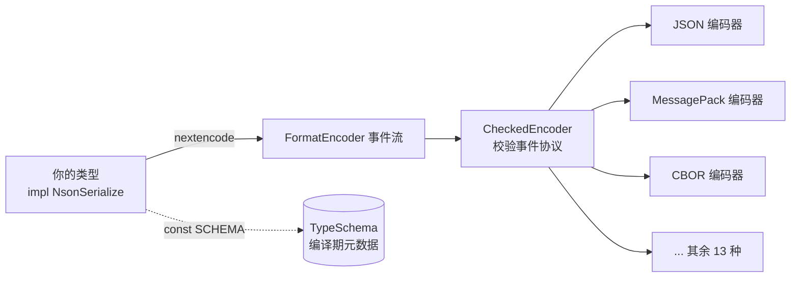
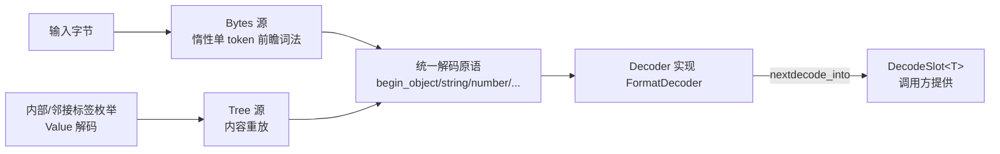
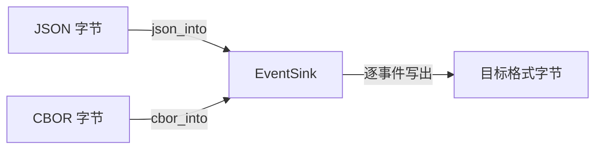

# Architecture

NextJson 的架构可以压缩成一句话：**一个类型契约、两条输入路径、一套格式中立
事件协议**。本页先给模块图，再用两个具体的"值"走完全程，让你看到每一层到底
在干什么。

## 模块结构

```text
nextjson/
├── lib.rs            # 根：trait/类型 re-export、顶层 API、__private
├── ser.rs            # NsonSerialize + FormatEncoder + CheckedEncoder + 编码器
├── de.rs             # NsonDeserialize + FormatDecoder + Decoder + Token + DecodeSlot
├── encoding.rs       # 顶层 nextencode / nextdecode / to_writer / from_reader
├── schema.rs         # NsonSchema + TypeSchema/StructSchema/EnumSchema/...
├── json_schema.rs    # TypeSchema → JSON Schema 的 Value 生成
├── number.rs         # Number（i64/u64/i128/u128/f64 无损）
├── value.rs          # Value（自描述 JSON AST）
├── map.rs            # Map（插入序对象，BTreeMap 索引 + Vec）
├── bytes.rs          # Bytes<'a> 借用字节串包装
├── error.rs          # Error（kind/line/column/offset）+ FormatError + Result
├── write.rs          # 自定义 no_std Write trait
├── stream.rs         # StreamDecoder（std 流式解码）
├── cross_format/     # EventSink 流式跨格式中继（json_into/cbor_into/...）
├── formats/          # 16 格式引擎 + 注册表 + tree.rs 共享中继层
├── serde_compat/     # serde 兼容层
└── private.rs        # 宏生成代码引用的隐藏项
nextjson-derive/      # 手写 proc_macro（attr/case/de/ser/schema）
```

## 编码：一个 `User` 是怎么变成 JSON 字节的

先看流程，再逐步拆开：



假设你写 `nextjson::nextencode(&user)`，内部发生的事：

1. `nextencode` 创建一个 **`FastEncoder<Vec<u8>>`**（`Encoder<W, false>`，见
   [[Performance]]），你的 `User::nextencode(&user, &mut encoder)` 被调用；
2. `User` 的派生代码按字段顺序发射事件：`begin_object` → `key("user_id")` →
   `write_u64(7)` → `key("name")` → `write_str("Ada")` → ... → `end_object`；
3. 事件落到 **JSON 编码器**：`begin_object` 写 `{`，`key` 写 `"user_id":`，
   `write_str` 做字符串转义后写入……最终得到
   `{"user_id":7,"name":"Ada","tags":["compiler"]}`。

如果你显式使用 **`CheckedEncoder`**（校验型包装，公开 API），事件会先经过它：
`CheckedEncoder` 不产出任何字节，只盯着事件顺序——数组元素之前必须有
`separator`、对象值之前必须有 `key`。这是给"自定义/第三方编码器"上的保险：
如果某个 `NsonSerialize` 实现把事件顺序搞错了，会在协议层立刻报错，而不是让
具体格式收到一段含义不明的字节流。

关键点：**你的类型只发射"事件"，不关心字节长什么样**。同一组事件喂给
MessagePack 编码器，得到的就是二进制 msgpack。这就是"一套实现驱动 16 种格式"
的落点（详见 [[Multi-Format Engine]]）。

> 注意：`nextencode` 顶层入口走免校验的 `FastEncoder`（信任派生代码，serde 同款
> 信任模型），因为派生代码的调用序列是编译期确定的，再校验一遍是白付 ~2x 编码
> 开销；`CheckedEncoder` 留给手写 impl 与自定义编码器场景。两种策略的选择逻辑见
> [[Design-Decisions]] 与 [[Performance]]。

## 解码：JSON 字节是怎么变回 `User` 的



`nextjson::nextdecode::<User>(bytes)` 的内部：

1. 构造 `Decoder`，输入源是 **`Bytes(&[u8])`**——它不预先扫描全文，而是
   **一次只词法一个 token**：需要 `key` 就切出下一个字符串，需要数字就解析
   下一个数字；
2. `User::nextdecode_into(&mut decoder, &mut slot)` 被调用。派生代码依次
   `begin_object` → `object_key` → 读字段值写入字段级槽 → ... → 全部成功后组装
   `Self` 写入 `slot`；
3. 输入源换成 **`Tree`** 的场景：内部/邻接标签枚举、`Value` 解码、TOML/YAML
   这类"先把整棵树收集起来再解码"的格式。`Tree` 源把预存的 `Vec<Token>` 逐个
   吐给同一套原语——**派生代码根本不知道自己在哪条路径上**；
4. 未转义的字符串（如 `"Ada"`）在 `Bytes` 路径直接切输入切片（`Cow::Borrowed`，
   零分配）；含转义的字符串才物化新 UTF-8 字节（`Cow::Owned`）。

两种输入源暴露完全相同的 `FormatDecoder` 原语，这是整个解码侧"只有一套机制"的
根基（详见 [[Unified Token Stream]]）。

## 跨格式中继：不建 `Value` 树也能互转



`cross_format::EventSink` 是仓库自有的格式中立协议，覆盖完整 JSON 数据模型。
`json_to_cbor` / `cbor_to_json` 等入口**逐事件**转发：`{` → 对象开始，`"a"` →
键，`1` → 数字……内存占用不随文档树增长，适合"只转发不解析语义"的代理 / 日志 /
网关场景。事件级细节见 [[Cross-Format Relay]]。

## 关键设计交汇点

| 关注点 | 落点 |
| --- | --- |
| 类型如何描述自己 | `NsonSchema::SCHEMA`（[[Compile-Time Schema]]） |
| 值如何编码 | `NsonSerialize::nextencode` → `FormatEncoder` |
| 值如何解码 | `NsonDeserialize::nextdecode_into` → `FormatDecoder` |
| 解码到哪 | `DecodeSlot<T>`（[[Decode Slot]]） |
| 输入是什么 | `Decoder`（Bytes/Tree 双源，[[Unified Token Stream]]） |
| 数字如何保真 | `Number`（[[Number Model]]） |
| 错误如何携带位置 | `Error`（[[Error Model]]） |
| 格式如何抽象 | `Format` + 注册表（[[Multi-Format Engine]]） |

