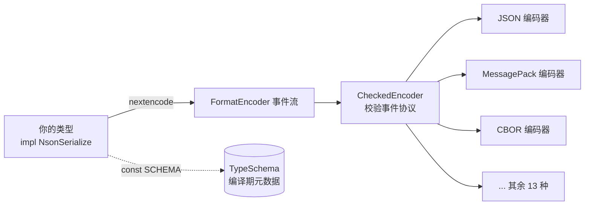
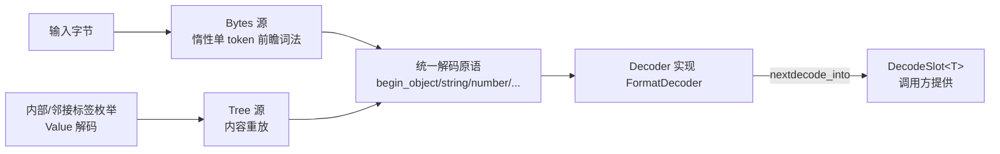
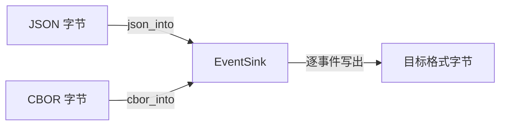

# Architecture

NextJson 的架构围绕"**一个类型契约、两条输入路径、一套格式中立事件协议**"展开。
以下是模块图与数据流。

## 模块结构

```text
nextjson/
├── lib.rs            # 根：trait/类型 re-export、顶层 API、__private
├── ser.rs            # NsonSerialize + FormatEncoder + CheckedEncoder + 编码器
├── de.rs             # NsonDeserialize + FormatDecoder + Decoder + Token + DecodeSlot
├── encoding.rs       # 顶层 nextencode / nextdecode / to_writer / from_reader
├── schema.rs         # NsonSchema + TypeSchema/StructSchema/EnumSchema/...
├── json_schema.rs    # TypeSchema → JSON Schema 的 Value 生成
├── number.rs         # Number（i64/u64/i128/u128/f64 无损）
├── value.rs          # Value（自描述 JSON AST）
├── map.rs            # Map（插入序对象，BTreeMap 索引 + Vec）
├── bytes.rs          # Bytes<'a> 借用字节串包装
├── error.rs          # Error（kind/line/column/offset）+ FormatError + Result
├── write.rs          # 自定义 no_std Write trait
├── stream.rs         # StreamDecoder（std 流式解码）
├── cross_format/     # EventSink 流式跨格式中继（json_into/cbor_into/...）
├── formats/          # 16 格式引擎 + 注册表 + tree.rs 共享中继层
├── serde_compat/     # serde 兼容层
└── private.rs        # 宏生成代码引用的隐藏项
nextjson-derive/      # 手写 proc_macro（attr/case/de/ser/schema）
```

## 数据流：编码



- `CheckedEncoder` 包装任意 `FormatEncoder`，在事件到达具体格式前校验协议：
  数组元素必须先 `separator`、对象值必须先 `key`——否则自定义/第三方编码器收到
  非法事件序列时只能得到误导性错误。
- 计数式格式（msgpack / postcard）把 `separator` / `key` 当作元素/条目计数器；
  文档式格式（toml / yaml）先经 `CollectEncoder` 收集为 `Value` 再发射。

## 数据流：解码



两种输入源暴露完全相同的 `FormatDecoder` 原语，所以派生代码只有一套机制。
未转义字符串在 `Bytes` 路径直接借用输入（`Cow::Borrowed`）；转义字符串物化新
UTF-8 字节（`Cow::Owned`）。

## 跨格式中继（不建 Value 树）



`cross_format::EventSink` 是仓库自有的格式中立协议，覆盖完整 JSON 数据模型。
`json_to_cbor` / `cbor_to_json` 等入口流式互转，内存不随文档树增长。
详见 [[Cross-Format Relay]]。

## 关键设计交汇点

| 关注点 | 落点 |
| --- | --- |
| 类型如何描述自己 | `NsonSchema::SCHEMA`（[[Compile-Time Schema]]） |
| 值如何编码 | `NsonSerialize::nextencode` → `FormatEncoder` |
| 值如何解码 | `NsonDeserialize::nextdecode_into` → `FormatDecoder` |
| 解码到哪 | `DecodeSlot<T>`（[[Decode Slot]]） |
| 输入是什么 | `Decoder`（Bytes/Tree 双源，[[Unified Token Stream]]） |
| 数字如何保真 | `Number`（[[Number Model]]） |
| 错误如何携带位置 | `Error`（[[Error Model]]） |
| 格式如何抽象 | `Format` + 注册表（[[Multi-Format Engine]]） |
