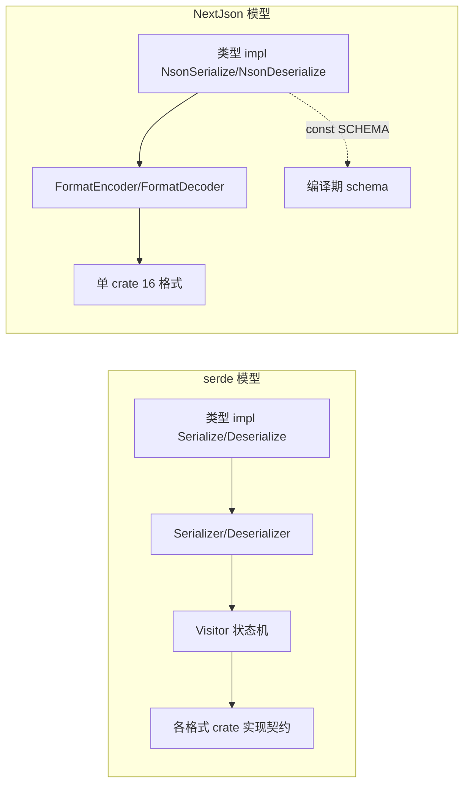

# Comparison with serde

本页是**事实对比**，不是"NextJson 更好"的断言。结论：NextJson 是 serde 的
**平行宇宙**，不是替代品。

## 一图看懂架构差异

## 一句话本质区别

**serde 是"类型向解码器索取"（Visitor），NextJson 是"类型直接告诉解码器往哪写"
（就地解码）**。这个方向差异向下推翻了整套 API 形状：

- serde 的 `Deserialize` 需要 `Visitor` 状态机来回调；
- NextJson 的 `nextdecode_into` 直接把结果写进调用方给的 `DecodeSlot<T>`，
  不需要 Visitor，也因此不需要 unsafe（见 [[Decode Slot]]）。

## 维度对比

| 维度 | serde | nextjson |
| --- | --- | --- |
| 解码机制 | `Deserialize` + **`Visitor`** 回调 | `nextdecode_into` **就地写入 `DecodeSlot<T>`** |
| 类型自省 | 无（schemars 等第三方补） | `const SCHEMA: TypeSchema` 编译期内省 |
| 生态 | 数百 crate、事实标准 | 无第三方依赖，自含 16 格式 |
| 代码生成 | serde_derive（syn/quote） | 手写 proc_macro（零依赖） |
| unsafe | 内部使用 | 全库 `deny(unsafe_code)` |
| no_std | serde 可；serde_json 仅 std | 核心 `no_std + alloc` |
| 格式数 | 每格式一 crate | 单 crate 16 格式 |
| JSON 性能（本机） | 800 MB/s 编码 / 186 解码 | 368 MB/s 编码 / 131 解码（~2.17x / ~1.4x） |
| 格式完整性 | 每 crate 完整实现 | 诚实子集（见 [[Format Matrix]]） |
| 错误 | serde_json 有 line/column | line/column/offset + 分类 |
| 非有限浮点 | serde_json 无 feature 时输出 null | 显式报错 |

## NextJson 的差异化优势（都有实现证据）

1. **零依赖可审计构建图**：`cargo tree` 只有两个本地 crate，CI 有
   `dependency-audit` 门禁守着。
2. **编译期 schema**：`const SCHEMA` 零运行时开销、类型自描述、可生成 JSON
   Schema，实现与 schema 同源不漂移。
3. **解码内存复用**：`DecodeSlot` 由调用方提供，无需 `T: Default`/占位值。
4. **统一 Token 流**：Bytes/Tree 双源共用一套原语，枚举各形态无第二套实现。
5. **单 crate 多格式**：一套 impl 服务 16 格式；JSON↔CBOR 流式中继不建树。
6. **安全面**：全库无 unsafe、统一 128 递归上限、拒绝有损（无静默 null/丢精度）。
7. **诚实格式边界**：每种格式拒绝无法保真的值，文档列出支持子集。

## NextJson 的劣势（同样如实列出）

1. **生态隔离**：无法直接使用 serde 生态的三方类型（chrono/uuid/框架等），
   必须手写 impl 或 `remote`。
2. **JSON 热路径慢 ~2.17x**：通用 `FormatEncoder` 契约 + 非 Ryū 浮点 + 无十年
   单态化优化。**这个差距是设计目标换来的**——同一份实现驱动 13+ 种格式。
3. **格式不完整**：yaml/toml/json5 是子集；无 serde 各 crate 的完整功能。
4. **`Value` API 面窄**：无 JSON Pointer、无 `json!` 宏等（见
   [[Value and Map]]）。
5. **工程成本**：手写宏解析器要跟上 Rust 语法演进；16 格式的测试矩阵很重。

## 认知纠偏（避免"造假"的断言）

- ❌ ~~"serde 做不到紧凑二进制"~~ → ✅ serde + bincode/postcard 同样紧凑；差异在
  **显式可内省 schema**而非能力。
- ❌ ~~"serde 无法跨格式"~~ → ✅ serde-transcode 存在；差异在**单 crate 零依赖 +
  无中间 Value 树**。
- ❌ ~~"NextJson 全面更安全"~~ → ✅ NextJson 把 unsafe 面降为零且更简单；不做
  "全面更安全"的断言。

## 选型建议

| 场景 | 建议 |
| --- | --- |
| 接入现有 Rust 生态 / 生产 JSON 性能极限 | serde + serde_json |
| 零依赖 / no_std / 可审计安全 / 单码多格式 / schema 内省 | nextjson |
| 需要二者互转 | derive 支持 `#[serde(...)]` 属性别名 + `remote` 转发，但类型系统不互通 |

## 相关页面

- 安全对比细节：[[Safety Model]]
- 性能数据：[[Performance]]
- 格式能力：[[Format Matrix]]

